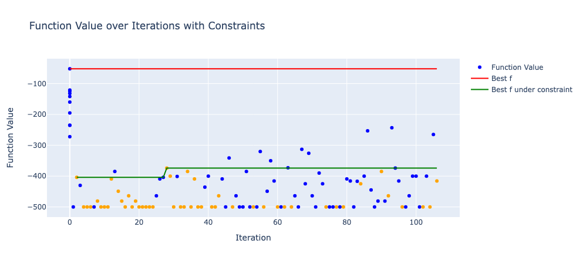
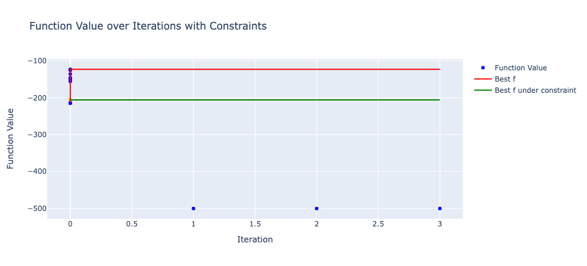
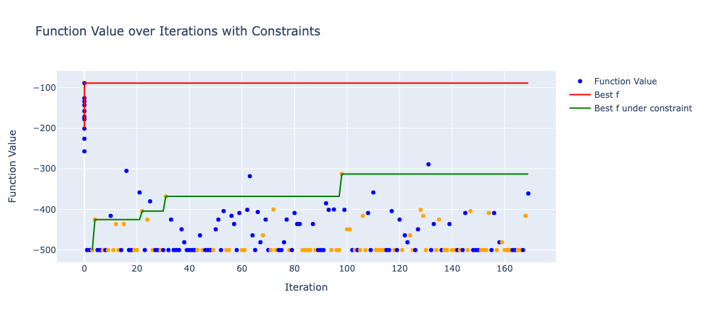
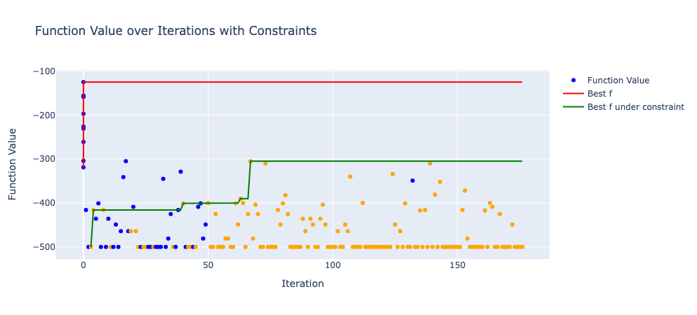
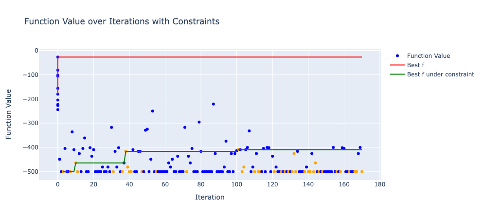
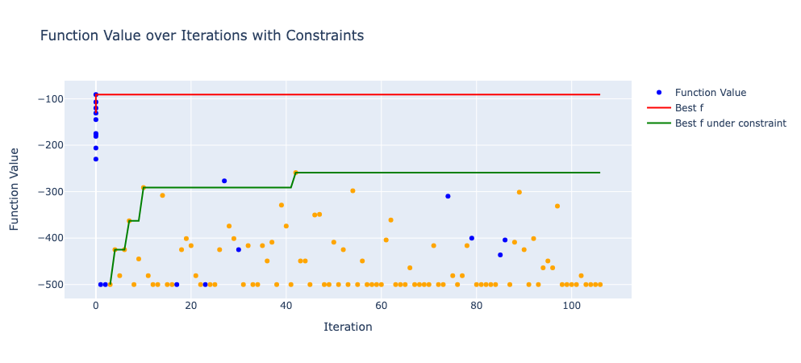

# 実験結果の可視化

__目的関数__

$f (\mathbf{x}) = - \sum_{i=1}^5 x_i^2$

__探索空間__

$x_i \in \{-10, -9, \dots, 9, 10\}$, for $i \in \{1, 2, 3, 4, 5\}$

__代理モデルの損失関数__

$L(\mathbf{w})$: MSE with L2 正則化項

$L_{constrained}(\mathbf{w}) = \lambda_1(1 - g(\mathbf{x}))\alpha(\mathbf{w}; \mathbf{x}) + \lambda_2 g(\mathbf{x}) L(\mathbf{w})$

__制約__

$g$: $x_1 = x_2$

__実験設定__

下のグラフの実験設定

| No. | 制約有無 | 損失関数のパラメータ          | 追加情報                                          | 出力クリッピング |
|-----|----------|------------------------------|-------------------------------------------------|-----------------|
| 1   | ✗        | -                            | -                                               | ✗               |
| 2   | ◯        | $\lambda_1 = 0.5, \lambda_2 = 0.5$ | 損失関数中の獲得関数の符号が反対だった              | ✗               |
| 3   | ◯        | $\lambda_1 = 0.5, \lambda_2 = 0.5$ | 損失関数中の獲得関数の符号が反対だった              | ◯               |
| 4   | ◯        | $\lambda_1 = 0, \lambda_2 = 1$    | -                                               | ✗               |
| 5   | ◯        | $\lambda_1 = 0, \lambda_2 = 1$    | -                                               | ◯               |
| 6   | ◯        | $\lambda_1 = 0.5, \lambda_2 = 0.5$ |                                    | ✗               |

__可視化__

- 下のグラフの番号は上の表の番号に対応しています．
- オレンジの点は，制約を満たすことを意味します．

## 1

制約無しです．

## 2

制約は有りですが，損失関数中の獲得関数の符号が反対になっていました．
結果として，無理な重みの更新の結果，代理モデルの予測分布の平均と分散が溢れてしまい，計算が止まっていました．

## 3

2 と基本的には同じですが，代理モデルの出力をクリッピングしています．

## 4

$\lambda_1=0$，つまり獲得関数が損失関数中に入らないモデルです．

## 5

4 に出力クリッピングをしたものです．

## 6

$\lambda_1=0.5, \lambda_2=0.5$ です．

